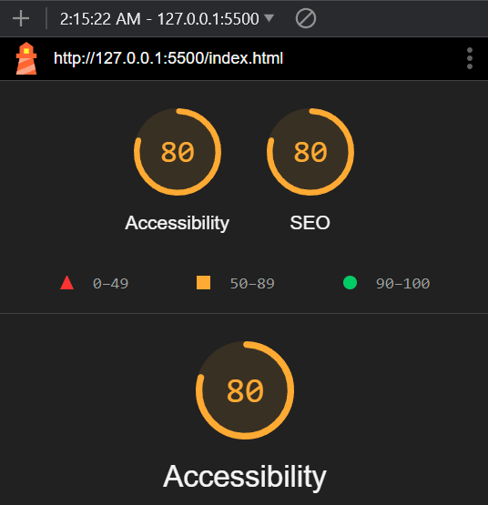

# LAB - Final Project

## T.M.I. (Task Management Interface)

I created the T.M.I. app because I recognized a need for a more streamlined, efficient way to manage tasks. In both personal and professional life, people often struggle to organize their to-do lists and prioritize their responsibilities effectively. This struggle can lead to stress, missed deadlines, and a decrease in productivity.

T.M.I. addresses this by offering an intuitive platform where users can easily create, manage, and track their tasks. With a focus on user experience, it simplifies task organization, helping individuals and teams stay on top of their responsibilities without feeling overwhelmed.

### Author: Lavieng Chanthabandith, Thomas Basham

### Links and Resources

* [HMTL](https://www.w3schools.com/html/default.asp)

* [CSS](https://www.w3schools.com/css/default.asp)

* [JavaScript](https://www.w3schools.com/js/default.asp)

### Lighthouse Accessibility Report Score

